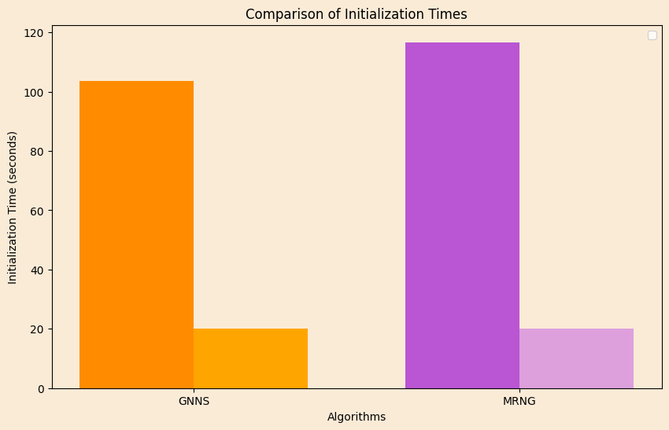
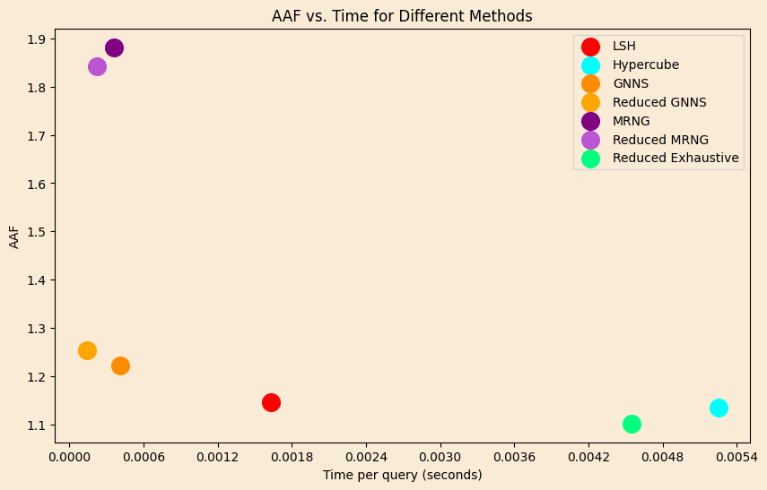
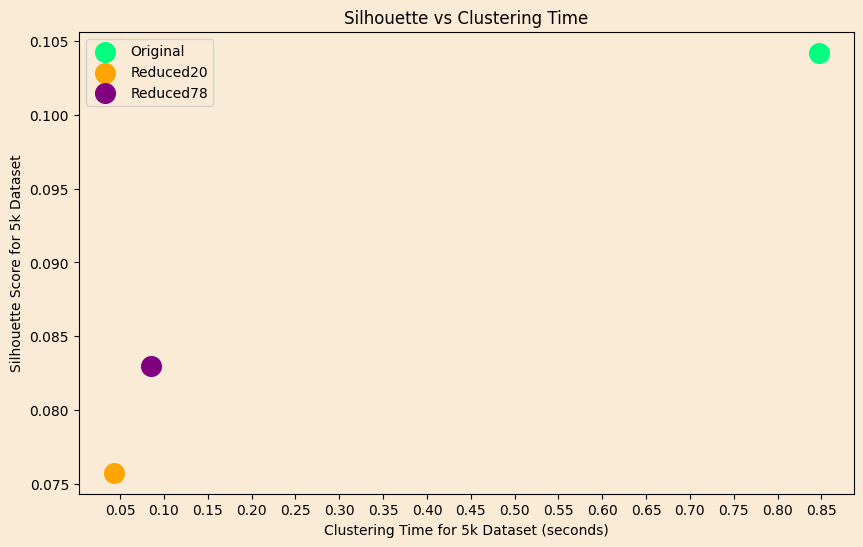

# Comparisons
## Table of Contents
- [Nearest Neighbors](#nearest-neighbors)
    - [Finding optimal parameters for reduced LSH](#finding-optimal-parameters-for-reduced-lsh)
    - [Graph Initializations](#graph-initializations)
    - [Approximation Factors](#approximation-factors)
- [Clustering](#clustering)
    - [General](#general)
    - [Results](#results)

## Nearest Neighbors
### Finding optimal parameters for reduced LSH
Our 20-dimensional encoding of the images worked exceptionally well, especially when considering the average approximation factor of all the `k-nearerest neighbors`. Our main problem was to find a set of parameters so that `LSH` in the reduced space could have a good balance of accuracy and speed, since `GNNS` (and `MRNG`, optionally) rely on it.

The latent space generally allowed for both a larger number of hashtables and a lower number of hyperplanes. In fact, while using only `3` hyperplanes was too slow and costly on the original `784` space, `3` hyperplanes were on the fast but innacurate side in our reduced space.  Since vector comparisons are much faster on it, we could push the algorithm to use only two hyperplanes and still be much faster than the original one. The hyperparameters we ended up with were the following:

* L = 8
* K = 2
* Window = 9
* TableSize = 7500
    
This combination on the reduced space is has a max factor of `1.9` compared to the original LSH but is also `3.3` times faster. 

### Graph Initializations
Both the `GNNS` and the `MRNG` initializations were significantly faster on the reduced space; `GNNS` was faster because of the faster `LSH` and `MRNG` was faster either because of the faster `LSH` or just because of the faster Eucledean distances, depending on the approach. The times for the for the `60k` dataset are shown below.

    

### Approximation Factors
Both `GNNS` and `MRNG` performed well on the reduced space, both halving their search time whilst virtually retaining their accuracies. The overall comparisons are shown below. Notice that the `MRNG` on the reduced space performed a bit better on average than the `MRNG` on the original one. What's also interesting, is that the reduced exhaustive search outperforms Hypercube, being both faster and more accurate.

Those test were performed on the `60k` dataset, on `5k` queries for a `10-nearest neighbor search`, with the `AAF` being the average of the approximation factors of all the nearest neighbors, then averaged for all the queries. (The code for the test is on the `src/comparisons.cpp`)

*Time of the exhaustive was approximately 10 times slower than hypercube.*

    

## Clustering
### General
In clustering there was indeed an improvement in the clustering time with small loss in the quality of the silhouette. In particular, for the tests we run on a `5k` subset of the dataset, which we clustered `100` times, both on the original and the reduced space, averaging the times and silhouettes yielded the below results. We also added the results of our `78-space` encoding for comparison. 

### Results

    

